---
## Front matter
lang: ru-RU
title: Лабораторная работа №1
subtitle: Презентация
author:
  - Зубов И.А.
institute:
  - Российский университет дружбы народов, Москва, Россия
date: 12 сентября 2026

## i18n babel
babel-lang: russian
babel-otherlangs: english

## Formatting pdf
toc: false
toc-title: Содержание
slide_level: 2
aspectratio: 169
section-titles: true
theme: metropolis
header-includes:
 - \metroset{progressbar=frametitle,sectionpage=progressbar,numbering=fraction}
---

# Информация

## Докладчик

  * Зубов Иван Александрович
  * Студент
  * Российский университет дружбы народов
  * 1132243112@pfur.ru

# Выполнение лабораторной работы

## Скачиваем и настраиваем виртуальную машину

:::::::::::::: {.columns align=center}
::: {.column width="70%"}

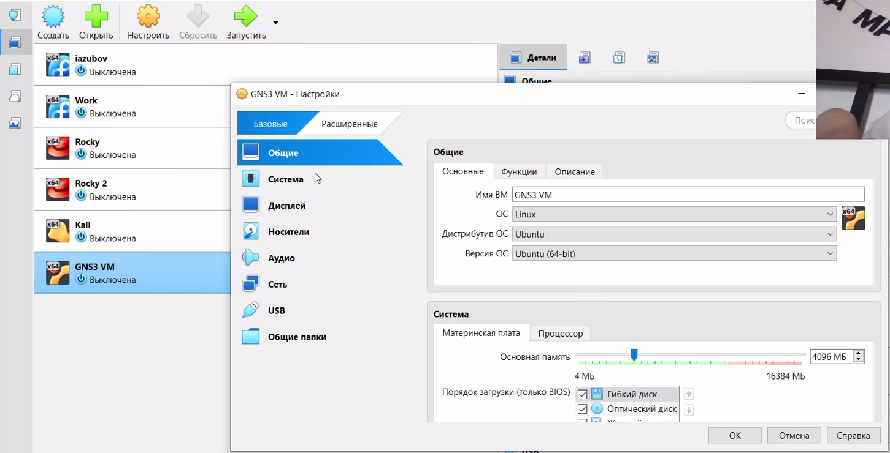

:::
::::::::::::::

## Устанавливаем GNS3

:::::::::::::: {.columns align=center}
::: {.column width="70%"}

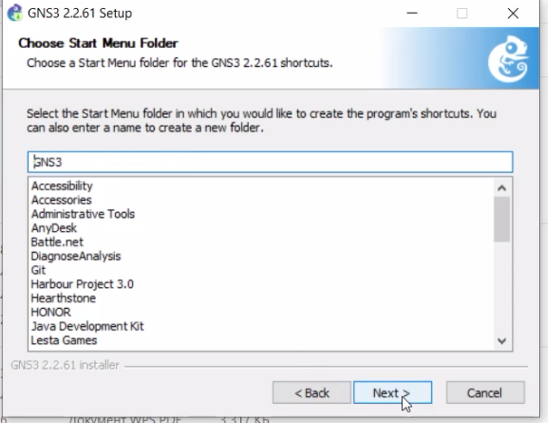

:::
::::::::::::::

## Запуск VM

:::::::::::::: {.columns align=center}
::: {.column width="80%"}

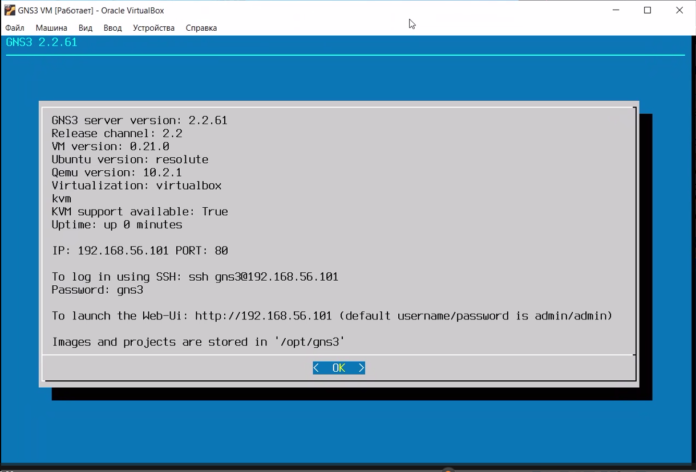

:::
::::::::::::::

## Настройке Gns3

:::::::::::::: {.columns align=center}
::: {.column width="80%"}

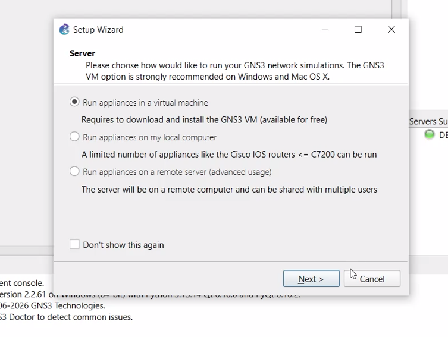

:::
::::::::::::::

## Параметры локального сервера GNS3

:::::::::::::: {.columns align=center}
::: {.column width="80%"}

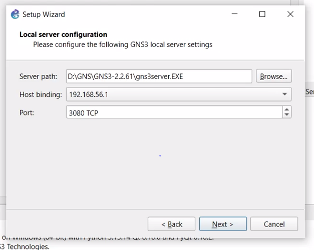

:::
::::::::::::::

## Импорт маршрутизатора FRR

:::::::::::::: {.columns align=center}
::: {.column width="80%"}

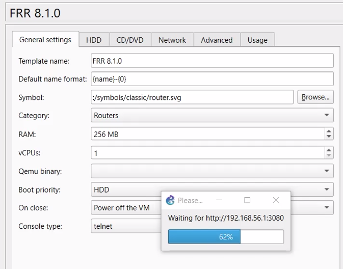

:::
::::::::::::::

## Новый проект

:::::::::::::: {.columns align=center}
::: {.column width="80%"}

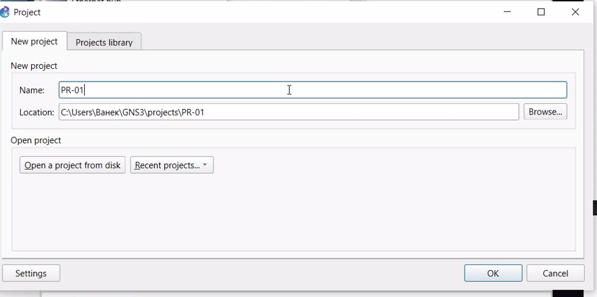

:::
::::::::::::::

## Импорт второго маршрутизатора — VyOS

:::::::::::::: {.columns align=center}
::: {.column width="80%"}

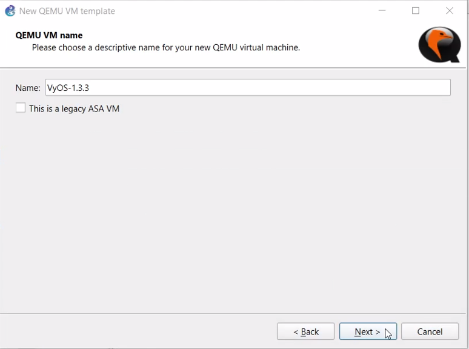

:::
::::::::::::::

## Проверка списка доступных сетевых устройств

:::::::::::::: {.columns align=center}
::: {.column width="80%"}

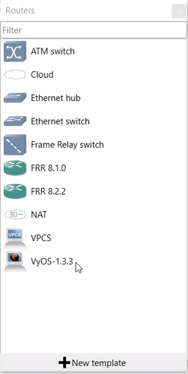

:::
::::::::::::::

## Проверяем работоспособность FRR

:::::::::::::: {.columns align=center}
::: {.column width="80%"}

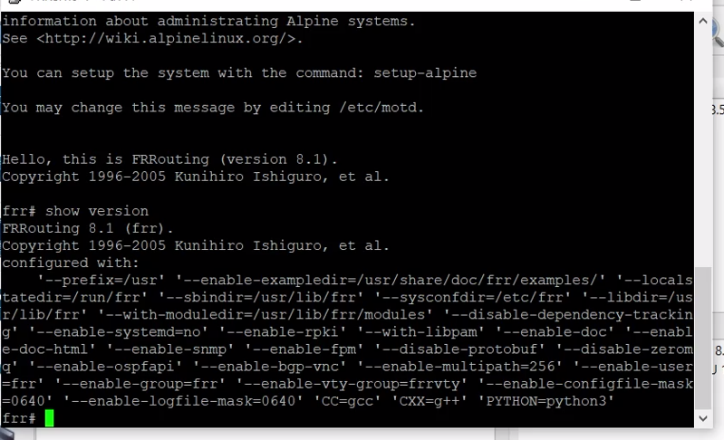

:::
::::::::::::::

## Проверяем работоспособность VyOS

:::::::::::::: {.columns align=center}
::: {.column width="80%"}

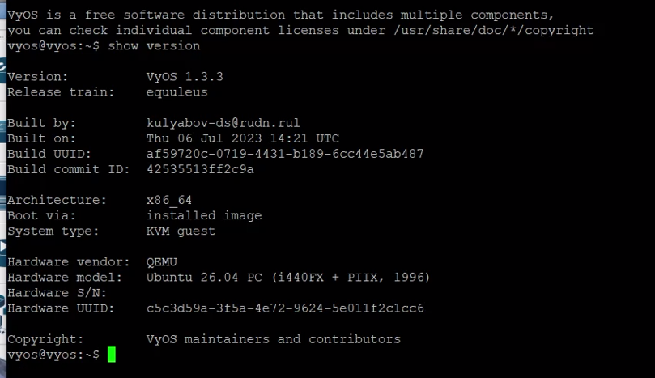

:::
::::::::::::::

